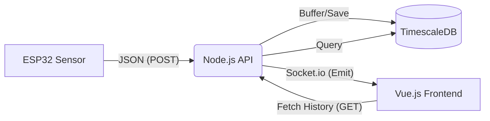

# ⚡ PowerQ: Real-time Energy Intelligence


## Mission Objective
PowerQ is an advanced real-time energy intelligence system. Built with strict  
**Clean Code** principles and a modular **MVC architecture**, it processes, archives, and visualizes measurement data in real-time.

---

## Architecture (The Blueprint)

The system consists of three coordinated layers communicating via secure channels:

1. **The Agent (Hardware):**  
   An ESP32 with a ZMCT103C sensor measures current (Amps) and transmits this intel via a secured REST API.

2. **The Mainframe (Backend):**  
   A Node.js API that buffers, validates, and stores data in **TimescaleDB** (PostgreSQL) for historical analytics, while broadcasting real-time data via WebSockets.

3. **The Dashboard (Frontend):**  
   A Vue.js 3 application functioning as Mission Control, complete with live charts and historical querying.

### Data Flow


---

## Tech Stack (The Gadgets)

### Hardware
- **MCU:** ESP32 Development Board  
- **Sensor:** ZMCT103C (Active Module with Op-Amp)  
- **Connection:** Wi-Fi (802.11 b/g/n)  

### Backend (The Archive)
- **Runtime:** Node.js (Express)  
- **Real-time:** Socket.io  
- **Database:** PostgreSQL + TimescaleDB (Docker)  
- **ORM:** Sequelize  
- **Pattern:** MVC + Service Layer  

### Frontend (Mission Control)
- **Framework:** Vue.js 3 (Composition API)  
- **Build Tool:** Vite  
- **Visualization:** Chart.js  
- **Styling:** Dark Mode / Terminal Style  

---

## Installation Protocol

### 1. Deploy TimescaleDB

```bash
docker run -d --name powerq-db -p 5432:5432 \
  -e POSTGRES_PASSWORD=secret \
  timescale/timescaledb:latest-pg14
```

### 2. Backend Deployment

```bash
cd backend
npm install
# Configure your .env file (see Security Clearance)
npm run dev
```

Server runs on **http://localhost:3000**

### 3. Frontend Deployment

```bash
cd frontend/Qpower
npm install
npm run dev
```

Dashboard runs on **http://localhost:5173**

---

## 🔐 Security Clearance

Both the ESP32 Agent and the Dashboard must authenticate.

Create an `.env` file inside **energy-backend**:

```env
PORT=3000
DB_NAME=postgres
DB_USER=<<USERNAME>>
DB_PASS=<<PASSWORD>>
DB_HOST=<<YOUR HOST>>
API_SECRET_KEY=<<YOUR SECRET KEY>> for connection between ESP32 AND backend
PASSWORD_FRONTEND=<<YOUR PASSWORD>> for connection between frontend and backend


```

**Authentication Format (Unified):**

```
Authorization: Bearer <API_SECRET_KEY>
```

---

## API Reference

### POST /api/measurements  
Inbound intel from the ESP32 Agent.  
**Headers:** `Authorization: Bearer <API_SECRET_KEY>`

```json
{
  "deviceId": "METER_01",
  "current": 0.45,
  "voltage": 230.0
}
```

### GET /api/measurements  
Retrieve last 50 historical records.  
**Headers:** `Authorization: Bearer <API_SECRET_KEY>`

---

## 🕵️ Author

**Pieter Leek**
use freely with strictly no warranty and support
